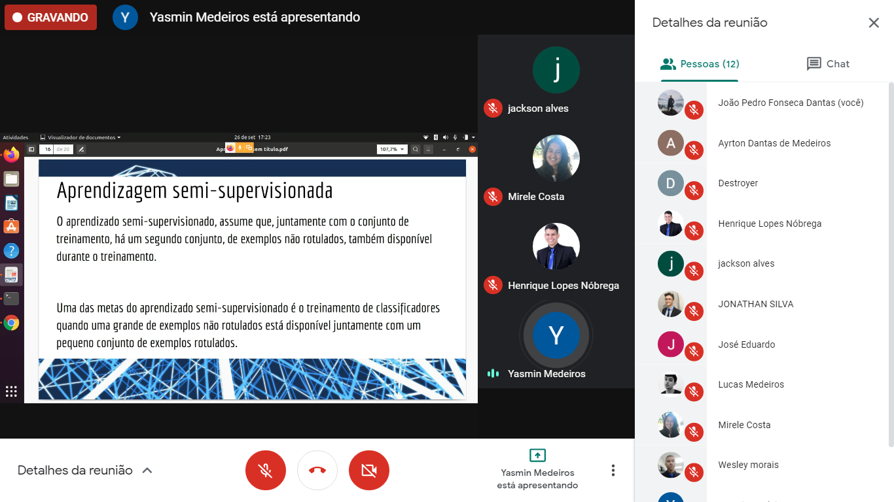

# Quinto MeetUp - Dev Seridó

- :calendar: Quando aconteceu?

- 26 de setembro de 2020
- Das 15 às 16 horas

- :round_pushpin: Onde aconteceu?

- No [Google Meet](media/slides-meetup5.pdf)

- :speech_balloon: O que foi abordado?

- O que é Inteligência Artificial
- Onde ela está no nosso dia-a-dia
- Quais áreas englobam a IA
- Qual o elemento principal da programação de uma IA

- :heavy_check_mark: O que foi produzido?

- [Slides](media/slides-meetup5.pdf)

- :globe_with_meridians: Links Importantes

1.  [Site Oficial do React Native](https://reactnative.dev/)

- :handshake: Quem participou?

- Cesário Pereira
- Ayrton Dantas
- Jonathan Tavares
- João Pedro Fonseca
- José Eduardo
- Lucas Medeiros
- Wesley Vitor
- Jackson Alves
- Henrique Lopes
- Mirele Costa
- Idaslon
- Charles Bezerra
